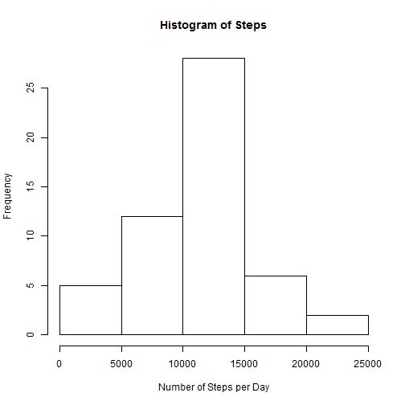
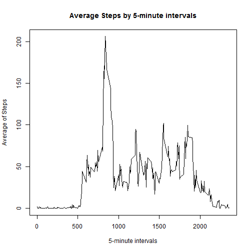
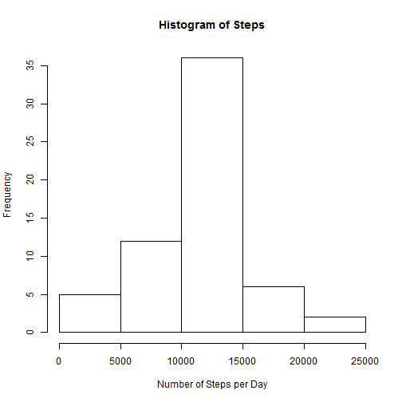
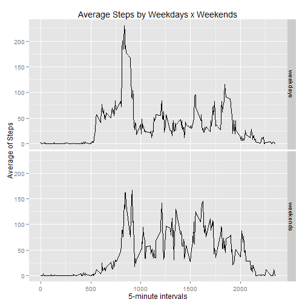

# Reproducible Research: Peer Assessment 1
## Josival Junior
---------------------------------------------------------

## Loading and preprocessing the data

Firstly, we need to unzip the zip file to access and load the data. The head() command
was used to check if the data were loaded correctly.


```r
setwd("C:\\Users\\Josival\\RepData_PeerAssessment1")
data <- read.csv(unz("activity.zip", "activity.csv"))
head(data)
```

```
##   steps       date interval
## 1    NA 2012-10-01        0
## 2    NA 2012-10-01        5
## 3    NA 2012-10-01       10
## 4    NA 2012-10-01       15
## 5    NA 2012-10-01       20
## 6    NA 2012-10-01       25
```

## What is mean total number of steps taken per day?

We need sum the number of steps taken by day before calculating the mean, using the funcion
tapply():


```r
# Removing missing values
dataComplete <- data[complete.cases(data),]

# Calculating the sum of steps by each day
sumSteps <- with(dataComplete, tapply(steps, date, sum))
```

The following graphic shows the histogram of steps per day:


```r
hist(sumSteps, main="Histogram of Steps", xlab="Number of Steps per Day")
```

 

The mean and median of steps per day, are calculated as:


```r
# Mean
mean(sumSteps, na.rm=T)
```

```
## [1] 10766
```

```r
# Median
median(sumSteps, na.rm=T)
```

```
## [1] 10765
```

They are almost the same, as expected in a symmetrical distribution as showed in the 
histogram.

## What is the average daily activity pattern?


```r
# Getting the complete observations
stepsComplete <- data[complete.cases(data),]

# Averaging the steps by 5-minute interval
avgSteps <- with(stepsComplete, tapply(steps, interval, mean))

# Plotting the average steps by 5-minute intervals
plot(avgSteps ~ names(avgSteps), type="l", main="Average Steps by 5-minute intervals",
     xlab="5-minute intervals", ylab="Average of Steps")
```

 

The 5-minute interval, on average across all the days in the dataset, that contains the
maximum number of steps is the 835 interval, with 206 steps, as showed in the following code:


```r
avgSteps[avgSteps == max(avgSteps)]
```

```
##   835 
## 206.2
```


## Imputing missing values

The missing values may introduce some bias in the analysis. Let's check the number of
missing values in our dataset:


```r
# Number of missings values in the steps column:
sum(is.na(data$steps))
```

```
## [1] 2304
```

To avoid this problem, let's fill the missing values with the mean steps of the interval:


```r
# Calculating the average steps per interval:
meanSteps <- with(dataComplete, tapply(steps, interval, mean))
meanSteps <- data.frame(interval = names(meanSteps), steps = meanSteps)


# Iterating through each observation

newData <- data

for (i in 1:length(newData$steps)) {
  
  # Checking if it's missing value
  if (is.na(newData$steps[i])) {
    
    # Replacing the NA by the mean steps of the interval
    newData[i,1] <- meanSteps[meanSteps$interval == newData[i,3],2]
    
  }
  
}

# Checking if the loop worked:
sum(is.na(data$steps)) # Original
```

```
## [1] 2304
```

```r
sum(is.na(newData$steps)) # Treated
```

```
## [1] 0
```

Now, let's see the histogram of total steps taken each day, as before, for the new dataset
with treated missings:


```r
# Calculating the sum of steps by each day
sumSteps2 <- with(newData, tapply(steps, date, sum))

# Plotting the Histogram
hist(sumSteps2, main="Histogram of Steps", xlab="Number of Steps per Day")
```

 

Let's see, too, the mean and median of total steps taken each day for for this new dataset:


```r
# Mean
mean(sumSteps2, na.rm=T)
```

```
## [1] 10766
```

```r
# Median
median(sumSteps2, na.rm=T)
```

```
## [1] 10766
```

In **conclusion**, the missings treatment method used affected only the median of the
total steps taken per day. The mean is still the same.

## Are there differences in activity patterns between weekdays and weekends?

Firstly, we need to create a new variable based on the day of the weekend:


```r
dayOfWeek <- weekdays(as.Date(newData$date))

# In portuguese (as my system is in this moment), the weekends are "sábado" e "domingo"
# Replacing the "sábado" and "domingo" strings to "weekend" and the rest to "weekday"

for (i in 1:length(dayOfWeek)) {
  
  if (dayOfWeek[i] %in% c("sábado","domingo")) {
    
    dayOfWeek[i] <- "weekend"
    
  } else {
    
    dayOfWeek[i] <- "weekday"
    
  }
  
}
```

Now, let's see the walking pattern between weekends and weekdays:


```r
# Mean of steps per interval on weekdays
avgWeekDays <- with(newData, tapply(steps[dayOfWeek == "weekday"], 
                                    interval[dayOfWeek == "weekday"], 
                                    mean))

# Mean of steps per interval on weekends
avgWeekends <- with(newData, tapply(steps[dayOfWeek == "weekend"], 
                                    interval[dayOfWeek == "weekend"], 
                                    mean))

# Building the data-frame to plot the results
stepsResults <- data.frame(interval = as.numeric(c(names(avgWeekDays), names(avgWeekends))),
                           dayOfWeek = c(rep("weekdays",length(avgWeekDays)),
                                         rep("weekends",length(avgWeekends))),
                           avgSteps = c(avgWeekDays,avgWeekends))

# Plotting the results using the ggplot2 package
library("ggplot2")
```

```
## Warning: package 'ggplot2' was built under R version 3.1.1
```

```r
qplot(interval, avgSteps, data = stepsResults, geom="line", facets=dayOfWeek~.,
      xlab = "5-minute intervals", ylab="Average of Steps", 
      main="Average Steps by Weekdays x Weekends")
```

 


